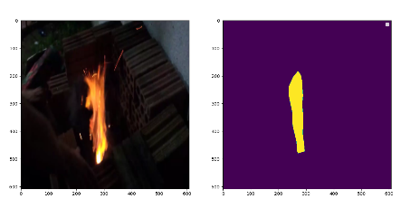

# QFireSeg
This library can quickly start fire segmentation, accurately and efficiently.

## How to train
> 1.Prepare your dataset(example dataset: [Fire-Segmentation](https://aistudio.baidu.com/aistudio/datasetdetail/167056)
> 
> 2.Create dataset list 
> 
> ```python utils/create_dataset_list.py```
> 
> 3.Train your model 
> 
> ```python train.py```

## How to infer

> Run ```python infer.py```
> 
> drink a coffee and then you can get a Visualization results like this:
> 
> 

## How to export inference model and run predict

> ```python export.py```
> 
> ```python predict.py --model_file ./inference_model/PSPnet.pdmodel --params_file ./inference_model/PSPnet.pdiparams --batch_size 1```
